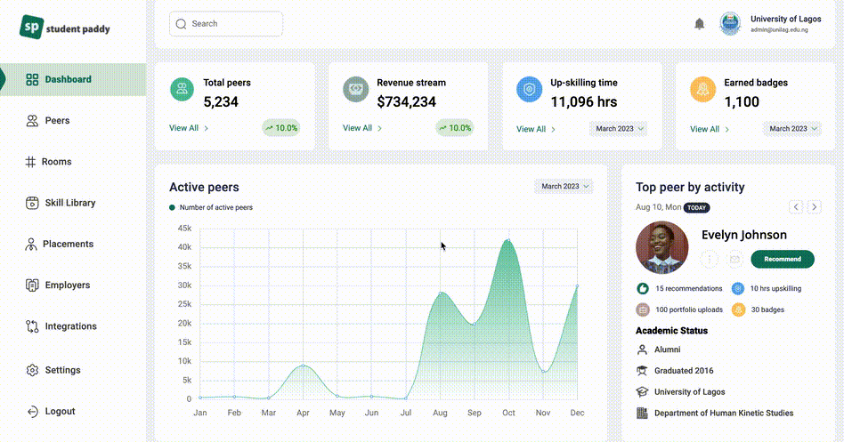

# Student Paddy Admin Dashboard

This is an admin dashboard for universities to track student career readiness on the Student Paddy digital campus. This project is a fully responsive web application built from scratch using Next.js 14. It showcases various UI features designed to provide a smooth user experience.

## Table of Contents

- [Preview](#preview)
- [Features](#features)
- [Technologies Used](#technologies-used)
- [Installation](#installation)
- [Contact](#contact)
- [License](#license)

## Preview


## Features

- **Responsive Design**: The website is optimized for all screen sizes, ensuring a great experience on both desktop and mobile devices.
- **Smooth Navigation**: Intuitive navigation for easy access to all sections.

## Technologies Used

- [Next.js 14](https://nextjs.org/)
- [React](https://reactjs.org/)
- [TypeScript](https://www.typescriptlang.org/) - Programming language that extends JavaScript
- [JavaScript](https://developer.mozilla.org/en-US/docs/Web/JavaScript)
- [Tailwind CSS](https://tailwindcss.com/) - CSS framework
- CSS custom properties
- Semantic HTML5 markup
- [Node.js](https://nodejs.org/) - JavaScript runtime environment

## Installation

To get started with this project locally, follow these steps:

1. Clone the repository:

   ```bash
   git clone https://github.com/ArinzeGit/student-paddy-admin-dashboard.git
   ```

2. Navigate into the project directory:

   ```bash
   cd student-paddy-admin-dashboard
   ```

3. Install the dependencies:

   ```bash
   npm install
   ```

4. Start the development server:

   ```bash
   npm run dev
   ```

5. Open your browser and visit [http://localhost:3000](http://localhost:3000) to view the application.

## Contact

If you have any questions or feedback, feel free to reach out:

- Email: arinzeowoh@gmail.com

## License

This project is licensed under the [MIT License](LICENSE).
